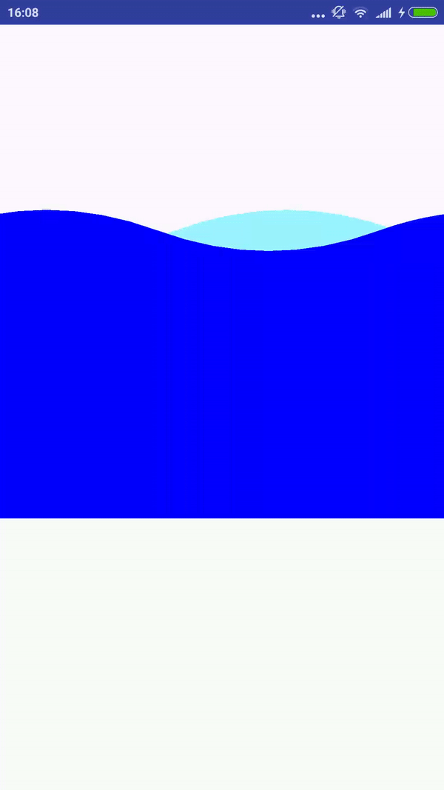

# simplewaveview
a simplewaveview use Bézier curve

## Screenshot


```
<?xml version="1.0" encoding="utf-8"?>
<LinearLayout xmlns:android="http://schemas.android.com/apk/res/android"
    android:layout_width="match_parent"
    android:layout_height="match_parent">
<com.simplewave.wave.library.WaveView
    android:id="@+id/id_waveview"
    android:layout_width="match_parent"
    android:layout_height="400dp" />
</LinearLayout>


protected void onCreate(@Nullable Bundle savedInstanceState) {
        super.onCreate(savedInstanceState);
        setContentView(R.layout.main_layout);
        mWave = (WaveView) findViewById(R.id.id_waveview);
        mWave.setBaseLine(500);
    }
```
